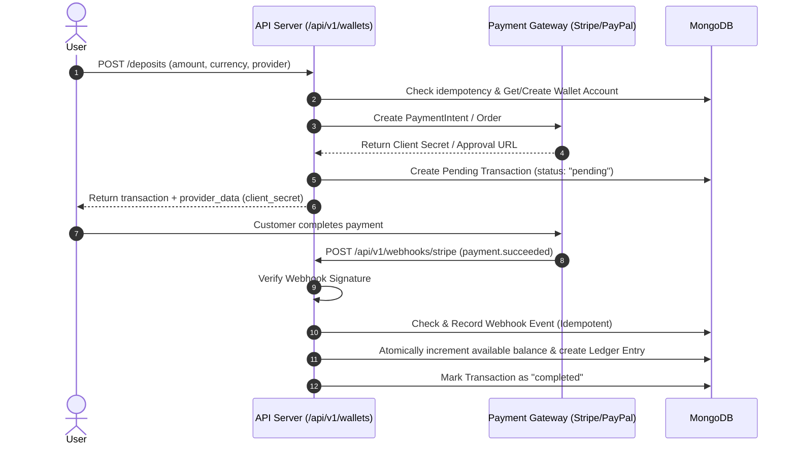
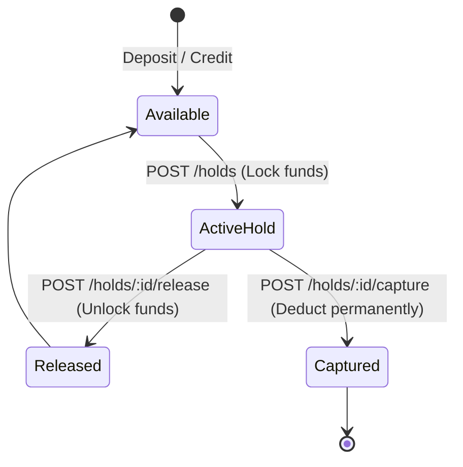

# User Wallet Module: Step-by-Step Workflow & Testing Guide

This document explains the architecture, business logic, step-by-step workflows, and complete test payloads for testing the User Wallet Module.

---

## 1. Architectural Overview & Design Principles

The wallet module operates as an **immutable double-entry financial ledger**:

```
                       USER REQUEST
                            │
                            ▼
                    IDEMPOTENCY CHECK
                            │
                            ▼
                   MONGODB TRANSACTION
              (snapshot read + majority write)
                            │
      ┌─────────────────────┴─────────────────────┐
      ▼                                           ▼
LEDGER ENTRY (Immutable)              WALLET ACCOUNT PROJECTION
(Debit/Credit, Balance Before/After)   (Conditional Atomic Update `$gte`)
      │                                           │
      └─────────────────────┬─────────────────────┘
                            ▼
                    TRANSACTION RECORD
                 (Status: Completed/Failed)
```

### Core Rules
1. **Integer Minor Units**: All monetary values are integers (e.g. ₹100.50 = `10050` paise, $25.00 = `2500` cents). Floating point arithmetic is forbidden.
2. **Three Balances Per Account**:
   - `available_balance_minor`: Funds free to spend/transfer.
   - `locked_balance_minor`: Funds held for pending withdrawals/authorizations.
   - `pending_balance_minor`: Provider earnings pending settlement/service completion.
3. **Double-Entry Financial Source of Truth**: The `user_wallet_ledger_entries` collection is append-only and cannot be mutated or deleted.
4. **Idempotency**: Every critical operation accepts an `idempotency_key` ensuring duplicate requests return the same response without duplicate balance charges.

---

## 2. Step-by-Step Operation Workflows

---

### A. Deposit Workflow (Two-Phase Verification)



1. **Step 1 (Initiate)**: Client calls `POST /api/v1/wallets/deposits`.
2. **Step 2 (Gateway Intent)**: Server calls Stripe or PayPal to generate a `client_secret` or approval link.
3. **Step 3 (Pending Transaction)**: A record is saved in `user_wallet_transactions` with status `"pending"`. Balance is **NOT** credited yet.
4. **Step 4 (Webhook Confirmation)**: Once the user pays, the gateway notifies `POST /api/v1/webhooks/stripe` or `/paypal`.
5. **Step 5 (Settlement)**: Signature is verified, idempotency checked in `user_wallet_payment_webhook_events`, wallet available balance is incremented, and an immutable ledger entry is written.

---

### B. Hold Lifecycle (Authorization & Capture/Release)



1. **Create Hold (`POST /holds`)**: Moves funds from `available_balance_minor` to `locked_balance_minor` atomically using a conditional update (`available >= amount`).
2. **Release Hold (`POST /holds/:id/release`)**: Moves funds back from `locked_balance_minor` to `available_balance_minor`.
3. **Capture Hold (`POST /holds/:id/capture`)**: Permanently consumes the locked funds (supports partial capture, releasing remaining balance back to available).

---

### C. Withdrawal Workflow

1. **Step 1 (Request)**: Client sends `POST /api/v1/wallets/withdrawals`.
2. **Step 2 (Hold Funds)**: Server locks the withdrawal amount (`available` $\rightarrow$ `locked`).
3. **Step 3 (Payout Initiation)**: Calls provider payout endpoint. Transaction status becomes `"processing"`.
4. **Step 4 (Outcome)**:
   - **Success Webhook**: `POST /webhooks/...` $\rightarrow$ Hold is **captured** (`locked` balance reduced), transaction becomes `"completed"`.
   - **Failure Webhook / Cancellation**: Hold is **released** (`locked` $\rightarrow$ `available`), transaction becomes `"failed"` or `"cancelled"`.

---

### D. Peer-to-Peer Transfer Workflow

1. **Step 1**: Client calls `POST /api/v1/wallets/transfers` with recipient `to_user_id`.
2. **Step 2 (Single Atomic Transaction)**:
   - Conditional atomic debit from Sender's Account (`available >= amount`).
   - Atomic credit to Receiver's Account (wallet/account auto-created if new).
   - Creation of `WalletTransfer` record.
   - Dual Ledger entries (Sender: `debit`, Receiver: `credit`).
3. If any step fails, the entire transaction rolls back cleanly.

---

### E. Refund & Reversal Workflows

- **Refund (`POST /refunds`)**: Validates that cumulative refunds do not exceed the parent transaction amount. Creates a new immutable child transaction (`type: "refund"`) with `parent_transaction_id`.
- **Reversal (`POST /reversals`)**: Reverses chargebacks/disputes. Verifies the state machine transition (`completed` $\rightarrow$ `reversed`), debits or credits appropriately, and updates the parent status.

---

## 3. Postman / HTTP API Test Payloads

> **Base URL**: `http://localhost:3000/api/v1`  
> **Auth Headers**: Include your Bearer token:  
> `Authorization: Bearer <YOUR_ACCESS_TOKEN>`

---

### 1. Wallet & Balance

#### `GET /wallets`
Fetch or auto-provision the user's primary wallet container.

#### `GET /wallets/accounts`
List all currency-specific accounts (INR, USD, NZD, etc.).

#### `GET /wallets/balance?currency=INR`
**Response Example:**
```json
{
  "success": true,
  "message": "Balance fetched successfully.",
  "code": 200,
  "data": [
    {
      "result": [
        {
          "account_id": "66c5a8e0f1d2a12345678901",
          "currency": "INR",
          "account_type": "customer_wallet",
          "status": "active",
          "available_balance_minor": 50000,
          "pending_balance_minor": 0,
          "locked_balance_minor": 10000,
          "total_balance_minor": 60000,
          "available_formatted": "₹500.00",
          "pending_formatted": "₹0.00",
          "locked_formatted": "₹100.00",
          "total_formatted": "₹600.00"
        }
      ]
    }
  ]
}
```

---

### 2. Deposits

#### `POST /wallets/deposits`
**Headers**: `Content-Type: application/json`  
**Body:**
```json
{
  "amount_minor": 50000,
  "currency": "INR",
  "provider": "stripe",
  "idempotency_key": "dep-user123-20260821-001",
  "description": "Top-up wallet with ₹500.00",
  "metadata": {
    "source": "mobile_app"
  }
}
```

#### `GET /wallets/deposits/:id`
Fetch status of a specific deposit transaction.

---

### 3. Holds

#### `POST /wallets/holds`
**Body:**
```json
{
  "wallet_account_id": "66c5a8e0f1d2a12345678901",
  "amount_minor": 10000,
  "currency": "INR",
  "reference_type": "order_booking",
  "reference_id": "66c5a8e0f1d2a12345678999",
  "description": "Pre-auth hold for Order #999"
}
```

#### `POST /wallets/holds/:id/release`
**Body:**
```json
{
  "reason": "Customer cancelled booking before service started"
}
```

#### `POST /wallets/holds/:id/capture`
**Body:**
```json
{
  "capture_amount_minor": 10000,
  "description": "Service delivered - final capture"
}
```

---

### 4. Withdrawals

#### `POST /wallets/withdrawals`
**Body:**
```json
{
  "amount_minor": 15000,
  "currency": "INR",
  "provider": "stripe",
  "payout_destination": "ba_1NxxxxxxEXAMPLE",
  "idempotency_key": "wth-user123-20260821-001",
  "description": "Payout to bank account"
}
```

#### `GET /wallets/withdrawals`
Query parameters: `?page=1&limit=10`

#### `POST /wallets/withdrawals/:id/cancel`
Cancel an un-processed withdrawal and release held funds back to available balance.

---

### 5. Peer-to-Peer Transfers

#### `POST /wallets/transfers`
**Body:**
```json
{
  "to_user_id": "66c5a8e0f1d2a98765432100",
  "amount_minor": 5000,
  "currency": "INR",
  "fee_minor": 0,
  "idempotency_key": "trf-20260821-001",
  "description": "Splitting dinner bill"
}
```

#### `GET /wallets/transfers`
List transfers sent or received by the user.

---

### 6. Refunds & Reversals

#### `POST /wallets/refunds`
**Body:**
```json
{
  "parent_transaction_id": "66c5a8e0f1d2a11122233344",
  "amount_minor": 2500,
  "currency": "INR",
  "reason": "Partial refund for defective item",
  "idempotency_key": "ref-20260821-001"
}
```

#### `POST /wallets/reversals`
**Body:**
```json
{
  "parent_transaction_id": "66c5a8e0f1d2a11122233344",
  "amount_minor": 50000,
  "currency": "INR",
  "reason": "Bank chargeback reversal",
  "idempotency_key": "rev-20260821-001"
}
```

---

### 7. Audit & Ledger Exploration

#### `GET /wallets/transactions`
Query parameters: `?type=deposit&status=completed&page=1&limit=20`

#### `GET /wallets/ledger`
Query parameters: `?account_id=66c5a8e0f1d2a12345678901&page=1&limit=20`  
Returns complete immutable ledger balance trails with `balance_before_minor` and `balance_after_minor`.

---

### 8. Webhook Simulation (Public Endpoints)

#### `POST /webhooks/stripe`
**Headers:**
- `stripe-signature`: `t=1724218000,v1=test_signature`
- `Content-Type`: `application/json`

**Sample Event Body:**
```json
{
  "id": "evt_test_12345",
  "object": "event",
  "type": "payment_intent.succeeded",
  "data": {
    "object": {
      "id": "pi_3NxxxxxxEXAMPLE",
      "amount": 50000,
      "currency": "inr",
      "status": "succeeded"
    }
  }
}
```

#### `POST /webhooks/paypal`
**Headers:**
- `paypal-auth-algo`: `SHA256withRSA`
- `paypal-cert-url`: `https://api.sandbox.paypal.com/v1/notifications/certs/CERT-ID`
- `paypal-transmission-id`: `trans-12345`
- `paypal-transmission-sig`: `signature-string`
- `paypal-transmission-time`: `2026-08-21T05:30:00Z`
- `Content-Type`: `application/json`

**Sample Event Body:**
```json
{
  "id": "WH-TEST-12345",
  "event_type": "PAYMENT.CAPTURE.COMPLETED",
  "resource": {
    "id": "CAPTURE-12345",
    "supplementary_data": {
      "related_ids": {
        "order_id": "ORDER-12345"
      }
    },
    "amount": {
      "value": "500.00",
      "currency_code": "INR"
    }
  }
}
```
